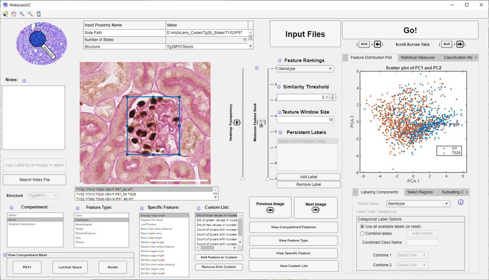

<!--
*** Thanks for checking out the Best-README-Template. If you have a suggestion
*** that would make this better, please fork the repo and create a pull request
*** or simply open an issue with the tag "enhancement".
*** Don't forget to give the project a star!
*** Thanks again! Now go create something AMAZING! :D
-->

<!-- PROJECT SHIELDS -->
<!--
*** I'm using markdown "reference style" links for readability.
*** Reference links are enclosed in brackets [ ] instead of parentheses ( ).
*** See the bottom of this document for the declaration of the reference variables
*** for contributors-url, forks-url, etc. This is an optional, concise syntax you may use.
*** https://www.markdownguide.org/basic-syntax/#reference-style-links
-->
[![LinkedIn][linkedin-shield]][linkedin-url]

<!-- PROJECT LOGO -->
 

  

<h3 align="center">HistoLens</h3>

  

    A user friendly GUI for in-depth quantitative analysis of histological image data
  

<!-- TABLE OF CONTENTS -->

  
Table of Contents

  <ol>
    <li>
      <a href="#about-the-project">About The Project</a>
      <ul>
        <li><a href="#built-with">Built With</a></li>
      </ul>
    </li>
    <li>
      <a href="#getting-started">Getting Started</a>
      <ul>
        <li><a href="#prerequisites">Prerequisites</a></li>
        <li><a href="#installation">Installation</a></li>
      </ul>
    </li>
    <li><a href="#usage">Usage</a></li>
    <li><a href="#contributing">Contributing</a></li>
    <li><a href="#license">License</a></li>
    <li><a href="#contact">Contact</a></li>
    <li><a href="#acknowledgments">Acknowledgments</a></li>
  </ol>

<!-- ABOUT THE PROJECT -->
## About The Project
 

  

<h3 align="center">HistoLens</h3>

  

    A user friendly GUI for in-depth quantitative analysis of histological image data
  

(<a href="#top">back to top</a>)

### Built With

* [Matlab AppDesigner](https://mathworks.com/)

(<a href="#top">back to top</a>)

<!-- GETTING STARTED -->
## Getting Started

HistoLens is compiled for installation in a Windows environment but can also be run directly from a Matlab instance.

### Prerequisites

Written and compiled using Matlab R2022a

### Installation

1. Download HistoLens_Demo_Files from [this link](https://buffalo.box.com/s/ifvp6mu9spcnzn8tag2gkq2k7lmn50n5/)
2. Access app installer from HistoLens_Demo_Files/Compiled_Application_Installer/
3. Double click on installer file.
4. Follow steps in installation using Administrator permissions when necessary.

(<a href="#top">back to top</a>)

### Using HistoLens
1. Look at the "HistoLens_Demo_Experiment_File.xml", edit file paths to match download location.
2. Double click on HistoLens.exe and click on "Input Files" at the top once it loads.
3. Click on "HistoLens Experiment File" in the "Select Type of Input" panel
4. Click on "Select Experiment File" button and select the edited "HistoLens_Demo_Experiment_File.xml" file.
5. Click "Done" after other fields in the File Input window automatically populate.
6. Back in the main window, click "Go!" button.
7. Select different sub-compartments under the "Compartment" list to access features of that sub-compartment.
8. Selecting different feature types under the "Feature Type" list will show all of the individual quantitative features that are grouped under that category.
9. To view the distribution of individual features, click on the "View Specific Feature" button.
10. To view all features describing a feature category of a given sub-compartment (ex: all Nuclear Color features), click on "View Feature Type" button.
11. Cycle through images using either the "Next Image" and "Previous Image" buttons or the left and right arrow keys. (note: click a blank area on the figure prior to using arrow keys if nothing happens)
12. Click around! Additional specific information about interactive elements can be accessed by clicking on the blue, circle-i information symbols scattered throughout.

(<a href="#top">back to top</a>)

<!-- LICENSE -->
## License

Distributed under the MIT License. See `LICENSE` for more information.

(<a href="#top">back to top</a>)

<!-- CONTACT -->
## Contact

Sam Border - spborder@buffalo.edu
Pinaki Sarder (PI) - pinakisa@buffalo.edu

(<a href="#top">back to top</a>)

<!-- MARKDOWN LINKS & IMAGES -->
<!-- https://www.markdownguide.org/basic-syntax/#reference-style-links -->
[license-shield]: https://img.shields.io/github/license/github_username/repo_name.svg?style=for-the-badge
[license-url]: https://github.com/SarderLab/HistoLens/master/LICENSE.txt
[linkedin-shield]: https://img.shields.io/badge/-LinkedIn-black.svg?style=for-the-badge&logo=linkedin&colorB=555
[linkedin-url]: https://linkedin.com/in/sam-border-341826a4
[product-screenshot]: https://github.com/SarderLab/HistoLens/Assorted_Images/Example_Screenshot_HighRankedFeatures.png

